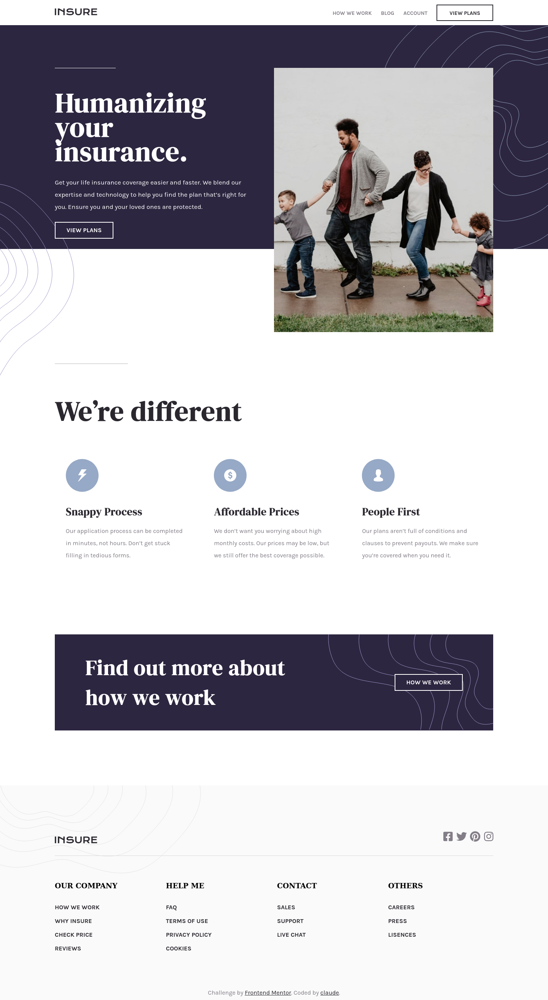

# Frontend Mentor - Insure landing page solution

This is a solution to the [Insure landing page challenge on Frontend Mentor](https://www.frontendmentor.io/challenges/insure-landing-page-uTU68JV8). Frontend Mentor challenges help you improve your coding skills by building realistic projects.

## Table of contents

- [Overview](#overview)
  - [The challenge](#the-challenge)
  - [Screenshot](#screenshot)
  - [Links](#links)
- [My process](#my-process)
  - [Built with](#built-with)s
  - [Continued development](#continued-development)
  - [Useful resources](#useful-resources)
- [Author](#author)

## Overview

### The challenge

Users should be able to:

- View the optimal layout for the site depending on their device's screen size
- See hover states for all interactive elements on the page

### Screenshot

<h2 align="center">Desktop[1440px]</h2>

### Links

- Solution URL: [Frontend Mentor](https://www.frontendmentor.io/solutions/insure-landing-page-using-sass-and-bundled-by-webpack-HJdTKtoQ9)
- Live Site URL: [Vercel](https://insure-landing-page-claude.vercel.app/)

## My process

### Built with

- Semantic HTML5 markup
- CSS custom properties
- Flexbox
- Mobile-first workflow
- [Webpack](https://webpack.js.org/) - module bundler
- [Sass](https://sass-lang.com/) - CSS preprocessor

### Continued development

- Add a design for tablet/s or medium screen sizes

### Useful resources

- [Webpack Documentation](https://webpack.js.org/concepts/)

## Author

- Frontend Mentor - [@claude1018](https://www.frontendmentor.io/profile/claude1018)
- Twitter - [@cla_ude1018](https://twitter.com/cla_ude1018)
